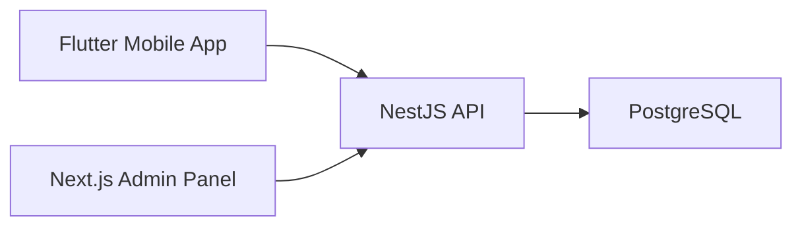

# Architecture

## Runtime

- Mobile communicates with the API through `API_BASE_URL`.
- Admin communicates with the API through `NEXT_PUBLIC_API_URL`.
- API validates requests, authenticates JWT tokens, applies role checks, and persists data in PostgreSQL.

## Backend Modules

- `auth` - registration, login, JWT authentication, role metadata.
- `users` - accounts, referral stats, admin user management.
- `blood-donors` - donor registration/search/availability.
- `hospitals`, `diagnostic-tests`, `hospital-test-prices`, `doctors` - healthcare catalog.
- `bookings`, `booking-payments`, `hospital-commissions`, `opening-balances` - booking and financial operations.
- `medicines`, `medicine-orders`, `delivery-zones`, `coupons` - medicine commerce flow.
- `notifications`, `tasks` - operational support.
